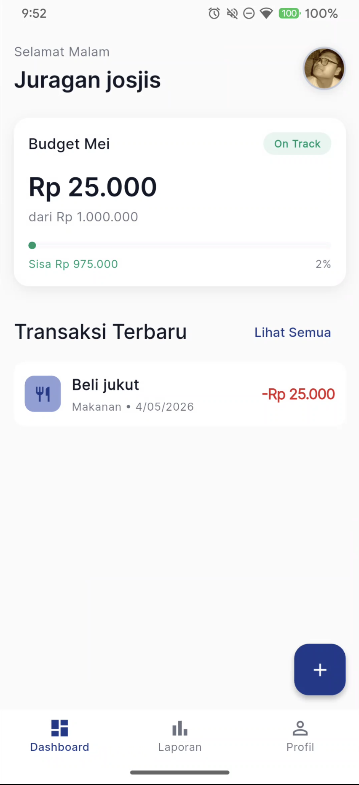
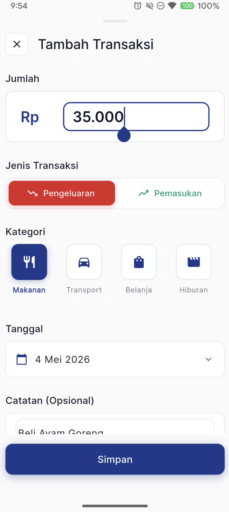
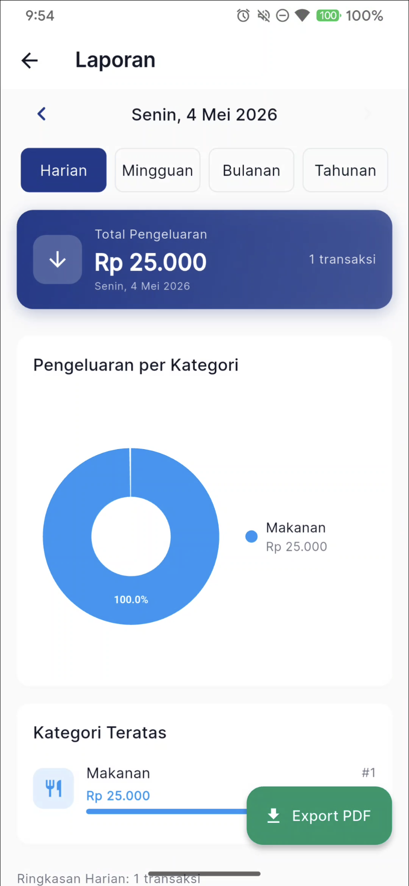
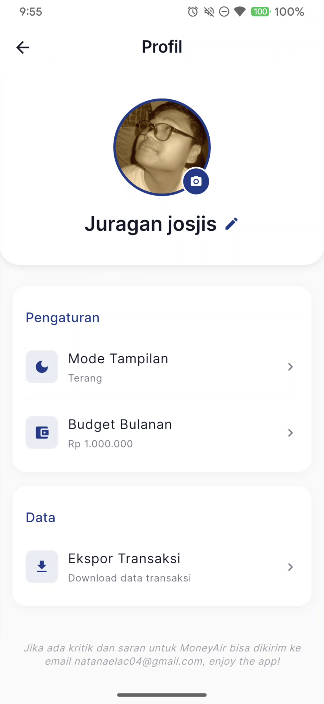

<p align="center">
  
</p>

<h1 align="center">MoneyAir 💰</h1>

<p align="center">
  <strong>Aplikasi pencatatan keuangan pribadi yang simpel, cepat, dan offline-first.</strong>
</p>

<p align="center">
  
  
  
  
</p>

---

## 📖 Tentang MoneyAir

**MoneyAir** adalah aplikasi manajemen keuangan pribadi berbasis Flutter yang dirancang untuk membantu Anda mencatat pemasukan & pengeluaran harian secara mudah dan terorganisir. Semua data tersimpan secara lokal di perangkat Anda — tidak membutuhkan koneksi internet maupun akun.

### ✨ Mengapa MoneyAir?

- 🔒 **Privasi Terjamin** — Data disimpan 100% lokal di perangkat, tanpa server pihak ketiga
- 📶 **Offline-First** — Berfungsi penuh tanpa koneksi internet
- ⚡ **Ringan & Cepat** — Ukuran APK hanya ~22 MB
- 🎨 **Desain Modern** — UI Material Design 3 dengan dukungan dark mode

---

## 🚀 Fitur Utama

### 📊 Dashboard
- Ringkasan keuangan bulanan (pemasukan & pengeluaran) dalam satu pandangan
- Kartu budget bulanan dengan progress bar visual
- Daftar 8 transaksi terbaru dengan akses cepat ke detail

### ➕ Tambah & Edit Transaksi
- Input jumlah dengan format otomatis (pemisah ribuan)
- Pilih tipe transaksi: **Pengeluaran** atau **Pemasukan**
- 11 kategori siap pakai: Makanan, Transportasi, Belanja, Hiburan, Kesehatan, Pendidikan, Tagihan, Gaji, Freelance, Investasi, dan Lainnya
- Pilih tanggal transaksi
- Tambahkan catatan opsional (maks. 100 karakter)
- Pilih dompet/sumber dana
- **Edit transaksi** yang sudah ada langsung dari detail transaksi

### 📈 Laporan Lengkap
- Filter periode: **Harian**, **Mingguan**, **Bulanan**, **Tahunan**
- **Navigasi ke periode sebelumnya/berikutnya** untuk melihat data historis
- Pie chart distribusi pengeluaran per kategori
- Daftar kategori teratas
- Daftar transaksi yang dapat di-expand per hari
- Ekspor laporan ke **PDF** dan bagikan langsung

### 👤 Profil
- Foto profil kustom (kamera atau galeri)
- Nama pengguna yang bisa diubah
- Pengaturan mode tampilan: Terang, Gelap, atau Ikuti Sistem
- Budget bulanan yang dapat disesuaikan
- Ekspor data transaksi ke PDF berdasarkan periode

---

## 📱 Tampilan

| Dashboard | Tambah Transaksi | Laporan | Profil |
|:---------:|:----------------:|:-------:|:------:|
|  |  |  |  |

---

## 📦 Instalasi

### Opsi 1: Download APK (Pengguna)

1. Kunjungi halaman [**Releases**](../../releases) pada repositori ini
2. Download file `MoneyAir.apk` (untuk sebagian besar perangkat Android modern)
3. Buka file APK pada perangkat Android Anda
4. Jika diminta, aktifkan **"Izinkan instalasi dari sumber tidak dikenal"** di pengaturan
5. Ikuti proses instalasi hingga selesai
6. Buka aplikasi **MoneyAir** dan mulai catat keuangan Anda! 🎉


### Opsi 2: Build dari Source Code (Developer)

#### Prasyarat

- [Flutter SDK](https://docs.flutter.dev/get-started/install) versi 3.6 atau lebih baru
- [Android Studio](https://developer.android.com/studio) atau [VS Code](https://code.visualstudio.com/) dengan ekstensi Flutter
- Android SDK dengan minimum API level 21 (Android 5.0)

#### Langkah-langkah

```bash
# 1. Clone repositori
git clone https://github.com/NatanaelAdrieChristiawan/TubesMoneyAir.git
cd TubesMoneyAir

# 2. Install dependensi
flutter pub get

# 3. Jalankan di emulator atau perangkat terhubung (mode debug)
flutter run

# 4. Build APK rilis (opsional)
flutter build apk --release --split-per-abi
```

File APK hasil build akan tersedia di:
```
build/app/outputs/flutter-apk/
```

---

## 🏗️ Arsitektur Proyek

```
lib/
├── main.dart                      # Entry point aplikasi
├── core/                          # Konfigurasi inti
│   ├── animations.dart            # Animasi & transisi kustom
│   ├── app_export.dart            # Barrel exports
│   ├── page_transitions.dart      # Transisi antar halaman
│   └── theme_controller.dart      # Controller mode tema
├── data/
│   ├── models/                    # Model data
│   │   ├── transaction_model.dart # Model transaksi
│   │   ├── budget_model.dart      # Model budget
│   │   └── user_model.dart        # Model pengguna
│   └── services/                  # Layanan data
│       ├── database_service.dart       # SQLite database service
│       ├── local_storage_service.dart  # SharedPreferences service
│       └── pdf_export_service.dart     # Layanan ekspor PDF
├── presentation/                  # Halaman & widget UI
│   ├── splash_screen/             # Splash screen
│   ├── dashboard_screen/          # Dashboard utama
│   ├── add_transaction_screen/    # Tambah/edit transaksi
│   ├── reports_screen/            # Laporan keuangan
│   └── profile_screen/            # Pengaturan profil
├── routes/                        # Konfigurasi navigasi
├── theme/                         # Tema aplikasi (light & dark)
└── widgets/                       # Widget global yang reusable
```

---

## 🛠️ Tech Stack

| Teknologi | Kegunaan |
|---|---|
| **Flutter 3.6+** | Framework UI cross-platform |
| **Dart 3.6+** | Bahasa pemrograman |
| **SQLite (sqflite)** | Database lokal untuk transaksi |
| **SharedPreferences** | Penyimpanan pengaturan pengguna |
| **Sizer** | Responsive layout |
| **Google Fonts** | Tipografi modern |
| **fl_chart** | Visualisasi data (pie chart) |
| **pdf + printing** | Ekspor & cetak laporan PDF |
| **image_picker** | Pemilihan foto profil |
| **intl** | Format tanggal & mata uang Indonesia |

---

## 📋 Cara Penggunaan

### Mencatat Transaksi Baru
1. Dari **Dashboard**, tekan tombol **+** di pojok kanan bawah
2. Masukkan **jumlah** transaksi
3. Pilih **tipe**: Pengeluaran atau Pemasukan
4. Pilih **kategori** yang sesuai
5. Pilih **tanggal** (default: hari ini)
6. Tambahkan **catatan** jika diperlukan
7. Pilih **dompet/sumber dana**
8. Tekan **Simpan**

### Mengedit Transaksi
1. Ketuk transaksi yang ingin diubah dari daftar di Dashboard atau Laporan
2. Pada modal detail, tekan tombol **Ubah**
3. Edit data yang ingin diubah
4. Tekan **Simpan** untuk menyimpan perubahan

### Menghapus Transaksi
1. Ketuk transaksi dari daftar
2. Pada modal detail, tekan tombol **Hapus**

### Melihat Laporan
1. Buka tab **Laporan** dari navigasi bawah
2. Pilih periode: Harian, Mingguan, Bulanan, atau Tahunan
3. Gunakan tombol **◀ ▶** untuk berpindah ke periode sebelumnya/berikutnya
4. Lihat pie chart dan kategori teratas
5. Tekan **Export PDF** untuk mengunduh laporan

### Mengatur Profil
1. Buka tab **Profil** dari navigasi bawah
2. Ketuk foto profil untuk mengubah gambar
3. Ketuk ikon ✏️ di samping nama untuk mengedit nama
4. Atur **Mode Tampilan** (Terang/Gelap/Sistem)
5. Atur **Budget Bulanan** sesuai kebutuhan

## 📬 Kritik & Saran

Jika Anda memiliki kritik, saran, atau menemukan bug, silakan hubungi melalui email:

📧 **natanaelac04@gmail.com**

---

## 📄 Lisensi

Proyek ini dilisensikan di bawah [MIT License](LICENSE).

---

<p align="center">
  Dibuat dengan ❤️ menggunakan Flutter
</p>
